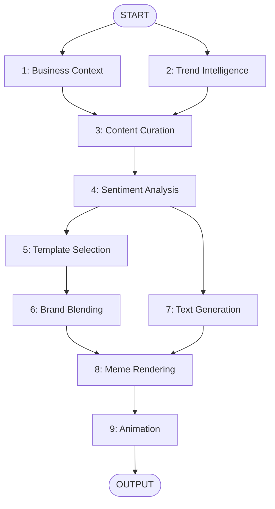

# 🚀 LangGraph Content & Meme Generation Automation

> Automated viral meme and multi-platform content generation powered by LangGraph and Google Gemini


---

## 📋 Overview

This is a **production-ready LangGraph automation system** that generates:

✅ Platform-optimized content (Twitter, Instagram, LinkedIn)  
✅ Context-aware, branded memes  
✅ Sentiment-driven visual selection  
✅ Automated animation (Veo 3/Nano Banana ready)

Built with **modular, testable nodes** and intelligent caching for cost-effective operation.

---

## 🏗️ Architecture

### 9 Modular Nodes



**See [langgraph_architecture.md](../brain/afe52581-768d-4496-a5b7-cf3ba0797afd/langgraph_architecture.md) for detailed specifications.**

---

## 🚀 Quick Start

### 1. Installation

```bash
# Clone the repository
cd content-meme-automation

# Create virtual environment
python3 -m venv venv
source venv/bin/activate  # On Windows: venv\Scripts\activate

# Install dependencies
pip install -r requirements.txt
```

### 2. Configuration

```bash
# Copy environment template
cp .env.example .env

# Edit .env with your API keys
nano .env
```

**Required API Keys:**
- `GOOGLE_API_KEY` (recommended) OR `OPENAI_API_KEY`

### 3. Prepare Input Folders

#### `business_documents/` 
Add your business context files:
```
business_documents/
├── business_overview.md
├── tone_of_voice.md
├── target_audience.txt
└── dos_and_donts.md
```

Supported formats: `.txt`, `.md`, `.pdf`, `.docx`

#### `brand_identity/`
Configure your brand:
```json
{
  "brand_name": "REKT",
  "primary_color": "#FF6B35",
  "secondary_color": "#004E89",
  "font_family": "Impact",
  "logo_path": "logo.png",
  "text_style_rules": {
    "uppercase": true,
    "font_weight": "bold",
    "stroke_color": "#000000",
    "stroke_width": 2
  },
  "visual_tone": "edgy"
}
```

#### `rekt_meme_templates/`
Organize templates by category:
```
rekt_meme_templates/
├── reaction_memes/
│   ├── surprised_pikachu.png
│   └── drake_meme.png
├── success_failure/
│   ├── stonks.png
│   └── not_stonks.png
└── philosophical/
    └── galaxy_brain.png
```

### 4. Run the Automation

**NEW: Flow-Based Architecture** - Run flows individually or all at once!

#### Option A: Run Everything at Once (Simplest)
```bash
./scripts/run_all.sh
```

#### Option B: Run Individual Flows (Maximum Control)
```bash
# Step 1: Generate text content
./scripts/run_text.sh
# Note the Run ID output!

# Step 2: Generate meme (use Run ID from step 1)
./scripts/run_meme.sh --run-id run_20260113_072000_a1b2

# Step 3: Animate meme (use same Run ID)
./scripts/run_animation.sh --run-id run_20260113_072000_a1b2
```

#### Option C: Use Main CLI
```bash
# Activate venv first
source venv/bin/activate

# Run all flows
python3 main.py

# Run specific flow
python3 main.py --flow text
python3 main.py --flow meme --run-id run_20260113_072000_a1b2

# With configuration overrides
python3 main.py --override "platforms=twitter,tone=edgy"
python3 main.py --flow text --override "platforms=twitter"
```

**See [QUICKSTART.md](QUICKSTART.md) for detailed usage examples.**

---

## ⚙️ Configuration Options

### Environment Variables

| Variable | Description | Default |
|----------|-------------|---------|
| `GOOGLE_API_KEY` | Google Gemini API key | Required* |
| `OPENAI_API_KEY` | OpenAI API key (fallback) | Optional |
| `BUSINESS_DOCS_PATH` | Path to business docs | `./business_documents` |
| `BRAND_IDENTITY_PATH` | Path to brand config | `./brand_identity` |
| `MEME_TEMPLATES_PATH` | Path to templates | `./rekt_meme_templates` |
| `TWITTER_ACCOUNT_TYPE` | `standard` or `premium` | `standard` |
| `TWITTER_METHOD` | `api`, `scraping`, or `disabled` | `scraping` |
| `TREND_CACHE_HOURS` | Hours to cache trends | `1` |
| `SKIP_ANIMATION` | Skip animation generation | `false` |

*Either GOOGLE_API_KEY or OPENAI_API_KEY required

### CLI Options

```bash
python main.py --help
```

```
Options:
  --business-docs PATH       Path to business_documents directory
  --brand-config PATH        Path to brand_identity directory
  --templates PATH           Path to meme templates directory
  --output PATH              Output directory  [default: ./output]
  --platforms [twitter|instagram|linkedin]
                             Target platforms (repeatable)
  --skip-animation           Skip animation generation
  --animation-style [auto|blink|bounce|shake|glow|zoom|none]
                             Animation style  [default: auto]
  --force-refresh-context    Ignore business context cache
  --force-refresh-trends     Ignore trending topics cache
  --help                     Show this message and exit
```

---

## 📊 Output Structure

After execution, finds your generated assets organized by run ID:

```
output/
└── runs/
    └── run_20260113_072000_a1b2/    # Unique run ID
        ├── run_metadata.json         # Run tracking info
        ├── content/                  # Flow 1: Text outputs
        │   ├── platform_content.json
        │   ├── twitter_content.txt
        │   ├── instagram_content.txt
        │   ├── linkedin_content.txt
        │   ├── trends.json
        │   └── business_context.json
        ├── memes/                    # Flow 2: Meme outputs
        │   ├── final_meme.png        # ← Your meme!
        │   ├── branded_template.png
        │   └── meme_metadata.json
        ├── video/                    # Flow 3: Animation outputs
        │   ├── animated_meme.mp4     # ← Animated version!
        │   └── animation_metadata.json
        └── metadata/                 # Inter-flow data
            ├── text_output.json
            ├── meme_output.json
            └── animation_output.json
```

**Benefits of Run IDs:**
- Easy asset tracking across flows
- Chain flows by passing run ID
- Generate multiple variations from same content
- Clean, organized output structure

---

## 🧠 How It Works

### Intelligent Caching

**Business Context (Node 1)**
- Caches indefinitely based on file hash
- Only re-parses when files change or forced

**Trending Topics (Node 2)**
- **1-hour cache expiry**
- Configurable via `TREND_CACHE_HOURS`
- Manual refresh with `--force-refresh-trends`

### Multi-Platform Content (Node 3)

Generates platform-optimized content:

| Platform | Length | Style | Hashtags | Emoji |
|----------|--------|-------|----------|-------|
| **Twitter** | 280* or 4000** chars | Casual, punchy | 2-4 | Rich |
| **Instagram** | 125-150 words | Visual, storytelling | 5-10 | Rich |
| **LinkedIn** | 150-200 words | Professional | 2-3 | Minimal |

*Standard account | **Premium account

### Sentiment Analysis (Node 4)

Analyzes content to determine:
- Dominant emotion (joy, confidence, surprise, etc.)
- Humor type (satire, irony, witty, etc.)
- Meme-worthiness score (0-1)
- Visual vibe for template selection

### Brand Blending (Node 6)

Applies subtle brand touches:
- Color adjustment (10% intensity to preserve template)
- Logo watermark (60% opacity, 8% of width)
- Colored border (3px)

**Design principle: 80% original template, 20% brand**

---

## 🔧 Advanced Usage

### Programmatic Usage

```python
from src.flows import TextContentFlow, MemeGenerationFlow, AnimationFlow

# Run individual flow
text_flow = TextContentFlow(override_string="platforms=twitter")
text_output = text_flow.run()
run_id = text_flow.run_id

# Chain flows
meme_flow = MemeGenerationFlow(run_id=run_id)
meme_output = meme_flow.run()

animation_flow = AnimationFlow(run_id=run_id)
animation_output = animation_flow.run()

# Access outputs
print(f"Meme path: {meme_output['final_meme']['final_meme_image_path']}")
print(f"Video path: {animation_output['animated_meme']['animated_meme_video_path']}")
```

### Configuration Overrides

```python
# Override via string
flow = TextContentFlow(override_string="platforms=twitter,tone=edgy")

# Override via FlowConfig
from src.config import FlowConfig

config = FlowConfig()
config.set("platforms", ["twitter", "instagram"]) 
config.set("tone", "professional")

flow = TextContentFlow(config=config)
```

### Adding Custom Nodes

1. Create node file in `src/nodes/`
2. Import in `src/nodes/__init__.py`
3. Add to workflow in `src/graph/workflow.py`
4. Update state schema if needed

---

## 🎨 Extending the System

### Add Animation (Veo 3 Integration)

Update `src/nodes/meme_animation.py`:

```python
from google.cloud import aiplatform

def animate_with_veo3(image_path: str, style: str):
    # Initialize Vertex AI client
    client = aiplatform.VideoGenerationClient()
    
    # Generate animation
    response = client.generate_video(
        prompt=f"Add subtle {style} animation to this meme, keep it loopable",
        image_path=image_path,
        duration=3.0
    )
    
    return response.video_path
```

### Add Web Scraping for Trends

Update `src/nodes/trend_intelligence.py`:

```python
import snscrape.modules.twitter as sntwitter

def scrape_twitter_trends(keywords: List[str]):
    tweets = []
    for keyword in keywords:
        for tweet in sntwitter.TwitterSearchScraper(keyword).get_items():
            tweets.append(tweet)
            if len(tweets) >= 100:
                break
    return analyze_tweets(tweets)
```

---

## 📚 Project Structure

```
content-meme-automation/
├── main.py                     # CLI entry point
├── requirements.txt            # Dependencies
├── .env.example                # Environment template
├── .gitignore
├── README.md
├── src/
│   ├── nodes/                  # All 9 workflow nodes
│   │   ├── business_context.py
│   │   ├── trend_intelligence.py
│   │   ├── content_curation.py
│   │   ├── sentiment_analysis.py
│   │   ├── template_selection.py
│   │   ├── brand_blending.py
│   │   ├── text_generation.py
│   │   ├── meme_rendering.py
│   │   └── meme_animation.py
│   ├── graph/                  # LangGraph workflow
│   │   ├── state.py            # State schemas
│   │   └── workflow.py         # Graph definition
│   └── utils/                  # Utilities
│       ├── llm_utils.py
│       ├── file_utils.py
│       └── image_utils.py
├── business_documents/         # Input: Business context
├── brand_identity/             # Input: Brand config
│   └── brand_config.json
├── rekt_meme_templates/        # Input: Meme templates
│   ├── reaction_memes/
│   ├── success_failure/
│   └── philosophical/
├── output/                     # Generated assets
└── .cache/                     # Cache directory
```

---

## 🐛 Troubleshooting

### "No LLM API keys found"
Set either `GOOGLE_API_KEY` or `OPENAI_API_KEY` in `.env`

### "Directory not found"
Ensure all required folders exist:
```bash
mkdir -p business_documents brand_identity rekt_meme_templates output .cache
```

### "Font not found"
Install Impact font or specify a different font in `brand_config.json`

### Low meme quality
- Add more templates to increase variety
- Improve business documents for better context
- Adjust brand colors in `brand_config.json`

---

## 📈 Performance Tips

1. **Use caching**: Don't force refresh unless needed
2. **Skip animation**: Use `--skip-animation` for 2x faster execution
3. **Limit platforms**: Generate only what you need
4. **Optimize templates**: Keep template file sizes under 2MB

---

## 🔐 Security

- Never commit `.env` file to version control
- Use environment variables for all sensitive data
- Validate all user inputs before processing
- Sanitize file paths to prevent directory traversal

---

## 🤝 Contributing

Contributions welcome! Areas for improvement:

- [ ] Twitter API integration
- [ ] Google Veo 3 animation
- [ ] Nano Banana integration
- [ ] A/B testing framework
- [ ] Virality scoring model
- [ ] Automated posting

---

## 📄 License

MIT License - see LICENSE file for details

---

## 🙏 Acknowledgments

- **LangGraph** for workflow orchestration
- **Google Gemini** for cost-effective LLM
- **rembg** for background removal
- **Rich** for beautiful CLI output

---

## 📞 Support

For issues or questions:
- Create an issue in the repository
- Check the [Architecture Documentation](../brain/afe52581-768d-4496-a5b7-cf3ba0797afd/langgraph_architecture.md)

---

**Built with ❤️ for the REKT community**
